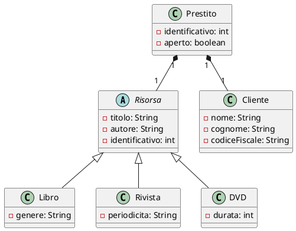

Esercizio Bibiloteca.
In questo esercizio dovsi deve implementare un sistema di gestione di una biblioteca.
La biblioteca permette di affittare diverse risorse bibliotecarie (libri, riviste, DVD)
e di gestire i prestiti e le restituzioni da parte di clienti.
Prima di fare un prestito bisogna salvare nel sistema alcune informazioni del cliente se non già presenti,
quali nome, cognome e codice fiscale (univoco per tutti gli utenti).
Tutte le risorse bibliotecarie hanno un titolo, un autore e un codice identificativo.
Per semplciità si supponga che ogni risorsa sia presente una sola volta nel sistema.
Nel caso di copie è neccesario creare due oggetti uguali ma con indentificativo diverso.
DVD inoltre sono caratterizzati da durata, Libri da genere e riviste da periodicità.
L'identificativo è un numero intero che deve essere unico per ogni risorsa all'interno del sistema
(ovvero ogni indentificativo non può essere duplicato, anche per tipi di risorse diverse).
Se la risorsa è disponibile, il prestito può essere effettuato.
Una volta che l'utente ha terminato di utilizzare la risorsa, può restituirla e renderla disponibile per altri utenti.
Il sistema deve tenere traccia di tutti i prestiti effettuati aperti e chiusi.
Una risorsa può essere prestata solo se non è già in prestito.

Implementare il sistema di gestione della biblioteca.
Il sistema dovrà permettere per prima cosa se si vuole fare un prestito o una restituzione.
Se si sceglie di fare un prestito, il sistema dovrà chiedere il codice fiscale del cliente che vuole fare il prestito
e verificare se il cliente è già registrato altrimenti registralo.
Il sistema dovrà poi chiedere il titolo della risorsa che si vuole prendere in prestito
e verificare se la risorsa è disponibile ed esista, in caso contrario restuire un messaggio di errore e tornare allo stato iniziale.
Se la risorsa è disponibile, il sistema dovrà registrare il prestito e renderla non disponibile.
Successivmente bisognerà stampare a video un resoconto del prestito effettuato, con le informazioni del cliente
e della risorsa presa in prestito (Tipo di risorsa, Titolo, Autore, Identificativo e dettagli relativi alla risorsa).
Se si sceglie di fare una restituzione, il sistema dovrà chiedere il codice identificativo della risorsa
e verificare se la risorsa è in prestito, in caso contrario restituire un messaggio di errore e tornare allo stato iniziale.
Se la risorsa è in prestito, il sistema dovrà registrare la restituzione e renderla disponibile per altri utenti.

Il sistema dovrà tenere traccia di clienti, prestiti e risorse all'interno di files.
Si supponga che una versione base dei file è già disponibile.

