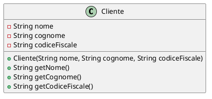

# 🏋️ Esercizio: Gestione Clienti Palestra

## Obiettivo

Realizzare un'applicazione Java per gestire i clienti di una palestra. L'applicazione deve permettere di:

- Caricare l'elenco dei clienti da un file.
- Registrare nuovi clienti, evitando duplicati.
- Stampare l'elenco completo dei clienti.
- Salvare eventuali modifiche sul file.

## Specifiche

Ogni cliente è caratterizzato da:

- Nome
- Cognome
- Codice Fiscale (univoco)

Il file dei clienti (`clienti.txt`) contiene i dati nel seguente formato, una riga per ogni cliente:

Nome;Cognome;CodiceFiscale

### Funzionalità richieste

1. **Caricamento clienti da file**  
   Il programma deve leggere i dati dei clienti da un file di testo all'avvio.

2. **Registrazione nuovo cliente**  
   Il programma deve permettere all'utente di inserire i dati di un nuovo cliente. Prima di aggiungerlo, deve verificare che il codice fiscale non sia già presente.

3. **Stampa elenco clienti**  
   Deve essere possibile stampare a schermo tutti i clienti attualmente registrati.

4. **Salvataggio su file**  
   Dopo ogni modifica (aggiunta di un cliente), il file deve essere aggiornato con la lista aggiornata.

## Requisiti tecnici

- Utilizzare la classe `Scanner` per la lettura del file.
- Gestire i clienti con una lista (`ArrayList`).
- Utilizzare una classe `Cliente` per rappresentare i dati di ogni persona.
- Usare tecniche di gestione dei file per leggere e scrivere i dati.

## Obiettivo didattico

Questo esercizio introduce alla gestione dei file in Java, alla creazione di classi per rappresentare dati, e all’uso del

## Class Diagram
